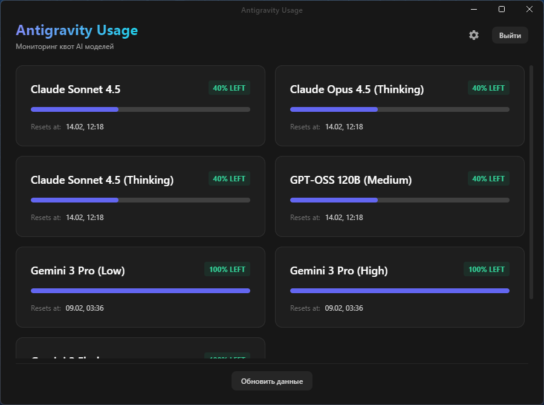

# Antigravity Usage GUI

Красивое, быстрое и удобное приложение для мониторинга квот ваших AI моделей в Antigravity. В отличие от CLI версии, это приложение работает прямо в вашем системном трее Windows и предоставляет наглядный графический интерфейс.

Этот проект полностью основан на оригинальном инструменте **[antigravity-usage](https://github.com/skainguyen1412/antigravity-usage)** от разработчика **[skainguyen1412](https://github.com/skainguyen1412)**. Огромная благодарность автору за основу и логику работы с API!



## Особенности

- 🌐 **Авторизация через Google**: Безопасный вход с поддержкой нескольких аккаунтов.
- 💻 **Локальное подключение**: Автоматическое обнаружение запущенных IDE (VS Code, JetBrains) для мгновенного получения квот.
- 📊 **Наглядный Дашборд**: Отслеживание остатка квот для Gemini, Claude и GPT в реальном времени.
- 📥 **Автообновления**: Приложение само скачивает новые версии прямо с GitHub.
- 🇷🇺 **Полная русификация**: Интерфейс и поддержка русского языка.
- 🎈 **Системный трей**: Приложение всегда под рукой, не занимает место на панели задач.

## Установка и запуск

> **Важно**: На данный момент проект распространяется только в виде исходного кода (архив). Для запуска вам потребуется [Node.js](https://nodejs.org/) (версии 18 или выше).

### Как запустить из исходников

1. Скачайте архив с кодом и распакуйте его, или клонируйте репозиторий:
   ```bash
   git clone https://github.com/acivnel/antigravity-usage-gui.git
   ```

2. Откройте терминал в папке проекта и установите зависимости:
   ```bash
   npm install
   ```

3. Запустите приложение в режиме разработки:
   ```bash
   npm run dev
   ```

### Сборка приложения (.exe)

Чтобы собрать готовый `.exe` файл для Windows:

```bash
npm run build:win
```
После завершения сборки установщик будет находиться в папке `dist`.

## Благодарности

- **[skainguyen1412](https://github.com/skainguyen1412)** — автор оригинальной консольной версии (CLI), на которой базируется этот проект.
- **[ccusage](https://github.com/ryoppippi/ccusage)** — проект, вдохновивший оригинал.

---
Создано с любовью для пользователей Antigravity.
